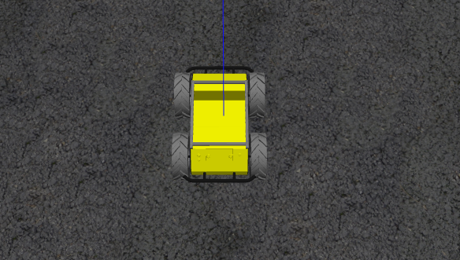

 # **小车的仿真与实机**

- Overview

- Simulation

- Px4_control

- Slam

- Map

- Image_process

- Planning

- lepus

  **注：有任何疑问都可在issues提问:)**


# Overview

- software frame


# Simulation



安装指导见   [**QuadGuidance.md**](./QuadGuidance.md)

# Px4_control

px4控制以及上层应用模块

## offboard 模式下走给定航点

```
roslaunch simulation mission_offboard_car.launch
```

打开地面站，解锁然后切OFFBOARD，小车即可走预定的航点，如果想要修改航点可修改mission_offboard_car.launch里的内容

```
roscd simulation
vim launch/Demo/px4_car/mission_offboard_car.launch
```

视频链接：[car offboard mission](https://www.bilibili.com/video/av92790324)

## offboard 模式下进行二维VFH避障

运行demo之前，请先在QGC中添加航点，然后上传，VFH节点将读取航点信息，当作目标点。

然后重新运行

```
roslaunch simulation avoidance_vfh_car.launch
```

中间终端为GCG中各航点的平面信息，读取航点成功后，在QGC地面站中切入offboard，然后小车将开始走航点。

视频链接：[car offboard vfh](https://www.bilibili.com/video/av97713134/)


# Slam


## cartographer
### 2Dlidar location

### 2Dlidar mapping

## rtabmap slam
# Map

# Image_process
# Planning

## ros navigation


# lepus

```
见 dir:volans/src/lepus/README.md
```


待定

  **注：有任何疑问都可在issues提问:)**
